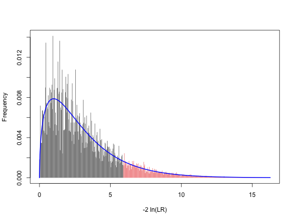
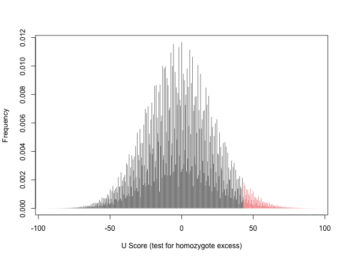
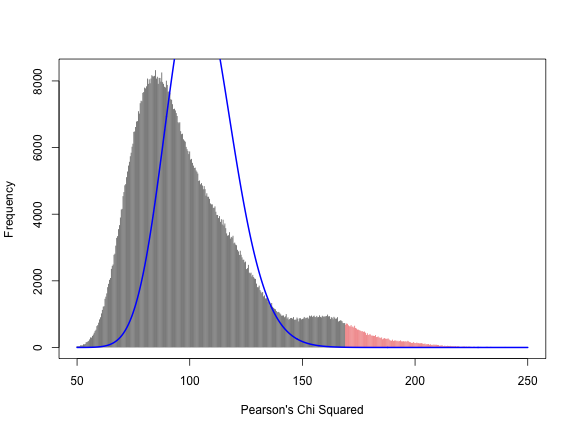

<!--
%\VignetteEngine{knitr}
%\VignetteIndexEntry{HWxtest}
-->


<STYLE type="text/css">
  h1,h2,h3,h4,h5 { 
    font-family: palatino, georgia, serif;
    color: Maroon;
  }
    h1, h6{
    text-align: center;
  }
  h1{line-height: 50px}
  body{
    font-size: 0.9em;
    line-height: 23px;
  }
  h3{
  font-weight: normal;
  font-size: 1.8em;
  }
  h6{
        font-size: 0.9em;
        font-weight: normal;
        line-height: 5px;      
   }
   hr{
     border-top-style: solid;
     border-top-width: medium;
   }
  code {
    font-size: 80%;
    line-height: 140%;
    border: 1px solid #ccc;
  }
   @media print{
  hr { 
      visibility: inherit;
      page-break-before: auto;
    }
   }
 </STYLE>


* * *
HWxtest -- Exact Tests for Hardy-Weinberg Proportions With Multiple Alleles
========================================================

###### William R. Engels  --  <wrengels@wisc.edu>  
###### University of Wisconsin, Madison -- Genetics Department
* * *
<center>
* [Main features](#intro)
* [Quick example](#qex)
* [Plot of test statistic](#plot1)
* [Extended example: Bowhead whales](#wex)
* [Inaccuracy in asymptotic tests](#asym)
* [Choice of test statistic](#stat)
* [Bibliography](#bib)
</center>

### <a name="intro">Main features</a>
The __HWxtest__ package tests whether a set of genotype counts fits Hardy-Weinberg proportions using the methods described by <a href="http://dx.doi.org/10.1534/genetics.109.108977">Engels (2009)</a>. The package's main features are:
* Performs fast exact test with any number of alleles
* The $P$ value is determined using a choice of test statistics (see [below](#stat)). One option is to test specifically for an excess of homozygotes or heterozygotes.
* Can handle data sets with multiple loci or populations. It accepts data from other population genetics software: *GenePop* (<a href="http://dx.doi.org/10.1111/j.1471-8286.2007.01931.x">Rousset, 2008</a>), *adegenet* (<a href="http://dx.doi.org/10.1093/bioinformatics/btn129">Jombart, 2008</a>), *pegas* (<a href="http://dx.doi.org/10.1093/bioinformatics/btp696">Paradis, 2010</a>). Multithreading is an option when analyzing a list.
* Can perform either full enumeration test or Monte Carlo, depending on which is optimal for a given data set.
* Includes functions for determining the number of tables for a given set of allele counts

### <a name="qex">Quick example</a>
Suppose you sample 279 individuals from a population and determine their genotypes at a particular 3-allele locus. If the allele names are $a_1, a_2$ and $a_3$, the genotype counts might be:
$$latex
{\bf{a}} = \left[ {\begin{array}{*{20}{c}}
{{a_{11}}}&{}&{}\\
{{a_{21}}}&{{a_{22}}}&{}\\
{{a_{31}}}&{{a_{32}}}&{{a_{33}}}
\end{array}} \right] = \left[ {\begin{array}{*{20}{c}}
{83}&{}&{}\\
{49}&{18}&{}\\
{74}&{34}&{21}
\end{array}} \right]
$$


That is, we observed 83 homozygotes for allele $a_1$, 49 heterozygotes of genotype $a_1/a_2$, and so on. The genotype counts are in the lower half of a $3 \times 3$ matrix. (These values come from <a href="http://dx.doi.org/10.3354/esr00459">Morin et al. (2012)</a>) We'll enter the numbers by rows in an *R* vector:

```r
obs <- c(83, 49, 18, 74, 34, 21)
```

To test whether these numbers fit the Hardy-Weinberg proportions, call the function `hwx.test`

```r
result <- hwx.test(obs)
result
```

```
## 
## *****    Sample of 279 diploids with 3 alleles
## Full enumeration of 204350 tables to test for HW
## 
## P value (LLR)   = 0.116908
## P value (Prob)  = 0.098767
## P value (U)     = 0.030499 (test for homozygote excess)
## P value (Chisq) = 0.109703
```

The output tells us that there are 204350 possible samples of 279 diploids with the same allele counts as the observed data. The $P$ values were computed by looking at each of those possibilities and adding up the total probability of all tables which deviate from HW by at least as much as the observed. 

But why does it report *four* different $P$ values? The reason is that there are several ways one can measure just how deviant a particular outcome is compared to the HW expectation. These measures are [explained in more detail below](#stat). Briefly, if you had no prior expectation that there might be too many homozygotes, then the first (*LLR*) $P$ value is recommended. However, if you had a prior suspicion that homozygotes would be in excess, such as from inbreeding, population admixture, null alleles, *etc.*, then the third choice (*U*) would be preferable.

### <a name="plot1">Plot a histogram of the test statistic</a>

The `hwx.test` function can also show a plot of how the test statistic is actually distributed, as opposed to its theoretical distribution for large samples. To do this, specify the number of bins to use in the histogram:

```r
hwx.test(obs, histobins = T)
```

 

```
## 
## *****    Sample of 279 diploids with 3 alleles
## Full enumeration of 204350 tables to test for HW
## 
## P value (LLR)   = 0.116908
## P value (Prob)  = 0.098767
## P value (U)     = 0.030499 (test for homozygote excess)
## P value (Chisq) = 0.109703
```

The red area represents those outcomes found to be more extreme than the observed data by the *LLR* criterion. In other words, the red area represents the $P$ value. The blue curve shows the theoretical $\chi^2$ distribution for comparison. In this case the fit is pretty good.

We can do the same thing for the *U* score by specifying the `statName`:

```r
hwx.test(obs, histobins = T, detail = 0, statName = "U")
```

 

Note that setting the parameter `detail` to zero suppresses the re-printing of the numbers.

### <a name="wex">Example with real data: bowhead whales</a>
A set of data from P. <a href="http://dx.doi.org/10.3354/esr00459">Morin et al. (2012)</a> includes genotypes of 280 whales from one population and 49 from another. Each individual was classified at 51 genetic loci. Some of these loci had more than 20 alleles. We can test for Hardy-Weinberg fit for each locus and each population:

```r
data(whales.genind)
wtest <- hwx.test(whales.genind)
```

Note that the format of the data is of class `genind` from the package `adegenet` which must be installed to perform the test. The result includes 102 individual tests, so let's not print them all out. Instead, we'll use the function `hwdf` to put the results in the form of a data frame, and look at just the first 10 in the list:

```r
dfwhales <- hwdf(wtest)
dfwhales[1:10, ]
```

```
##                         P-val(LLR)        ± SE  obs-LLR Method  Tables Trials   N k
## P1.BmC5R700_Y9101        6.276e-01          NA  -0.9044  exact    6160     NA 280 3
## P1.BmCATR205_R212        4.808e-01          NA  -1.5072  exact   15200     NA 280 3
## P1.BmCHYY286_R417        3.695e-01          NA  -2.9063  exact 1292854     NA 278 4
## P1.BmMPOR184_R284        1.169e-01          NA  -2.9735  exact  204350     NA 279 3
## P1.Bmys28Y154_R162       7.816e-01          NA  -1.3733  exact  176208     NA 277 4
## P1.Bmys387R245_R361      7.593e-01          NA  -0.6841  exact   11410     NA 279 3
## P1.Bmys404Y286_K316      3.593e-02          NA  -4.3185  exact  212551     NA 272 3
## P1.Bmys412R79_R463       2.347e-06          NA -14.0552  exact   12901     NA 280 3
## P1.Bmys42aK46_R225_K232  0.000e+00 ± 0.0000000 -30.0616  monte      NA  1e+05 263 7
## P1.Bmys43Y237_Y377       8.640e-03 ± 0.0002927  -8.6796  monte      NA  1e+05 277 4
```

The first column shows the population, such as "P1," and locus, such as "BmC5R700_Y9101" of each sample. The second column is the $P$ value from the *LLR* criterion by default. *N* is the number of diploid individuals in the sample and *k* is the number of alleles.

Note that there is a standard error associated with the last two tests, but not the others. This is because those two tests were done by the Monte Carlo method rather than full enumeration. The `hwx.test` function decides which method to use based on how many tables would need to be examined in order to do the full enumeration. In these two samples, the number of tables would be 3.8215 &times; 10<sup>22</sup> and 152168317  respectively, and that would take too long. Instead, `hwx.test` performed 100,000 random trials to estimate the $P$ value in each case.

If you need a more precise $P$ value than the one provided by 100,000 trials of the Monte Carlo test, there are two ways to do it. One way is to simply increase the Monte Carlo sample size. Suppose we want to do that for the 7-allele case, P1.Bmys42aK46_R225_K232, but not for the whole data set. We can start by pulling out the genotype counts for that specific test. These genotype counts are contained in the `wtest` object and can be picked out as follows:

```r
counts1 <- wtest$P1$Bmys42aK46_R225_K232$genotypes
counts1
```

```
##     001 002 003 004 005 006 007
## 001   1  NA  NA  NA  NA  NA  NA
## 002   1  19  NA  NA  NA  NA  NA
## 003   1  46  18  NA  NA  NA  NA
## 004   1  24  33   3  NA  NA  NA
## 005   1   7  17  10   5  NA  NA
## 006   0  14  19   7  14   4  NA
## 007   0   0   6   0   8   1   3
```

Now we can call `hwx.test` again, but increase the sample size to one million by changing the parameter `B`:

```r
hwx.test(counts1, detail = 1, B = 1e+06)
```

```
## P value (LLR) = 7e-06 ± 2.6457e-06
```

The standard error of the $P$ value is now considerably smaller. For the other sample, P1.Bmys43Y237_Y377, the number of tables is not as huge, and we can obtain an exact $P$ value by increasing the cutoff number. The following tells `hwx.test` to perform the full enumeration test instead of the Monte Carlo unless the number of tables exceeds 2 billion:

```r
counts2 <- wtest$P1$Bmys43Y237_Y377$genotypes
hwx.test(counts2, detail = 1, cutoff = 2e+08)
```

```
## P value (LLR) = 0.008886
```

This time, the $P$ value is reported without a standard error, indicating that an exact test with full enumeration was performed.

The results contained in `wtest` includes $P$ values for all [four criteria](#stat). So, for example, if we were interested in the *U* test rather than the *LLR* we could have specified that in the data frame call:

```r
hwdf(wtest, statName = "U")[1:10, ]
```

```
##                          P-val(U)        ± SE    obs-U Method  Tables Trials   N k
## P1.BmC5R700_Y9101       3.043e-01          NA -14.7089  exact    6160     NA 280 3
## P1.BmCATR205_R212       1.132e-01          NA -29.1880  exact   15200     NA 280 3
## P1.BmCHYY286_R417       3.130e-01          NA   9.2964  exact 1292854     NA 278 4
## P1.BmMPOR184_R284       3.050e-02          NA  43.7794  exact  204350     NA 279 3
## P1.Bmys28Y154_R162      3.124e-01          NA -13.6940  exact  176208     NA 277 4
## P1.Bmys387R245_R361     5.305e-01          NA  -0.8355  exact   11410     NA 279 3
## P1.Bmys404Y286_K316     2.630e-02          NA -45.3983  exact  212551     NA 272 3
## P1.Bmys412R79_R463      1.404e-07          NA -90.6985  exact   12901     NA 280 3
## P1.Bmys42aK46_R225_K232 3.530e-03 ± 0.0001876 128.7425  monte      NA  1e+05 263 7
## P1.Bmys43Y237_Y377      3.250e-01 ± 0.0014811  10.5665  monte      NA  1e+05 277 4
```

When using the *U* test, it is important to pay attention to the sign of *U*. If it is negative, as in the first two samples, the test is specifically for heterozygote excess. If it is positive, then we are testing for homozygote excess. This point will be discussed further [below](#stat).

Published data with genotype frequencies are often available in the *GenePop* format. These data can be easily converted to *genind* objects and then fed to `hwx.test`. For example, <a href="http://dx.doi.org/10.1111/mec.12644">Olsen et al. (2014)</a> provide a supplemental file containing genotype counts at 15 loci in 12 populations of sea urchins. We can pull those numbers in directly from the online source and analyze them as follows:

```r
urchin.url <- "http://tinyurl.com/m8f726w"
ufile <- file(urchin.url)
urchin.data <- genepop.to.genind(urchin.url)
hwdf(hwx.test(urchin.data))
```


### <a name="asym">Standard asymptotic tests are often inaccurate</a>
Most introductory genetics classes teach that the way to test for Hardy-Weinberg proportions is the standard $\chi^2$ test with $k(k-1)/2$ degrees of freedom. (I am guilty of this myself in teaching Genetics 466 at the University of Wisconsin!) The problem is that with real data and multiple alleles, there are often rare alleles which make the asymptotic test unreliable. For example, let's compare the actual $P$ values for the bowhead whale data as computed in the previous example with the corresponding $P$ values from the ordinary $\chi^2$ test. First we make a data frame from `wtest` and extract the true $P$ values from the first column and the approximations from the $10^{th}$ column: 

```r
df <- hwdf(wtest, showAsymptoticX2 = T)
pLLR <- df[[1]]
pAsy <- df[[10]]
plot(pLLR, pAsy)
lines(c(0, 1), c(0, 1))
```

 

The error for each point is the vertical distance from the diagonal. We can zoom in to see just the smallest $P$ values to see the extent of the errors in the most critical ranges:

```r
lim <- c(0, 0.2)
plot(pLLR, pAsy, xlim = lim, ylim = lim)
lines(c(0, 1), c(0, 1))
```

 

It's clear that the points are so widely scattered as to make the asymptotic tests essentially useless, even though the sample sizes are not small (especially for whales!). This analysis might be a bit too pessimistic, though, since it compares the true $P$ value based on the likelihood ratio against the approximate one based on the $X^2$ statistic. Therefore, to make the $P$ values more comparable, we will repeat the comparison, but with the true $X^2$ $P$ value versus the approximate one:

```r
dfx <- hwdf(wtest, statName = "Chisq")
pX2 <- dfx[[1]]
plot(pX2, pAsy)
lines(c(0, 1), c(0, 1))
```

 

```r
plot(pX2, pAsy, xlim = lim, ylim = lim)
lines(c(0, 1), c(0, 1))
```

 

There is still an unacceptable amount of scatter, but not quite as much as previously. To see the problem more clearly, let's focus on one of the samples where the asymptotic $P$ value was very far off. Specifically, look at locus $Bmy26$ from population $P2$:

```r
wtest$P2$Bmy26
```

```
## 
## *****    Sample of 47 diploids with 15 alleles
## Monte Carlo test for HW with 1e+05 trials.
## 
## P value (LLR)   = 0.390910 ± 0.001543
## P value (Prob)  = 0.375520 ± 0.0015314
## P value (U)     = 0.092830 ± 0.00091767 (test for homozygote excess)
## P value (Chisq) = 0.031430 ± 0.00055174
```

The genotype counts are contained within each test result of the `wtest` object, and we can extract them with the `$genotypes` specification. Then we'll re-analyze the data with `hwx.test` and plot the distribution of the $X^2$ statistic. While we're at it, let's increase the Monte Carlo sample size just to make a smoother curve:

```r
counts <- wtest$P2$Bmy26$genotypes
hwx.test(counts, statName = "Chisq", histobins = T, histobounds = c(50, 250), B = 1e+06)
```

 

```
## 
## *****    Sample of 47 diploids with 15 alleles
## Monte Carlo test for HW with 1e+06 trials.
## 
## P value (LLR)   = 0.389903 ± 0.00048773
## P value (Prob)  = 0.374552 ± 0.00048401
## P value (U)     = 0.093339 ± 0.00029091 (test for homozygote excess)
## P value (Chisq) = 0.031128 ± 0.00017366
```

Now the problem is clear! The shape of the true distribution is very different from the blue curve. The true curve has a shoulder on the right side. This shoulder is smaller than the main part of the curve, but it accounts for most of the $P$ value, as indicated by the red-shaded area. There are 15 alleles at the $Bmy26$ locus, and some of them are infrequent. The shoulder of the distribution represents those potential outcomes in which a rare genotype occurred. It is well known that the asymptotic $\chi^2$ distribution is not accurate when there are any small expected numbers.

### <a name="stat">Choice of test statistics</a>
To compute an exact $P$ value, one must have some way to determine which potential outcomes deviate from the expectations by at least as much as the observed. The catch is that there are different ways to define how much a particular outcome deviates from Hardy-Weinberg proportions. The choice of which criterion to use depends on the situation and on one's personal preference. For that reason, `HWxtest` provides a choice of four test statistics. Whenever you call `hwx.test` all four $P$ values are calculated, but it is best to decide ahead of time which one you will use. That is, it's not fair to pick and choose after the fact. 

Here are the test statistics used by `HWxtest` to order the potential outcomes and decide which are at least as deviant from HW as the actual observed outcome:

1. **Likelihood Ratio ($LLR$)** is simply the probability of a given outcome if HW proportions are true divided by the probability of the same outcome if the population's true genotype frequencies were anything else. For the denominator, assume the true genotype frequencies are exactly the same as in the outcome being considered. That is:
$$latex
LR = \frac{{\Pr (outcome|HW)}}{{\Pr (outcome|{\rm{best fit}})}}
$$
The numerator comes from <a href="http://dx.doi.org/10.1214/aoms/1177730093">Levene (1949)</a> and the denominator is a multinomial, so the formula for $LR$ works out to be:
$$latex
LR  = \frac{{\prod\limits_i {{m_i}^{{m_i}}} }}{{{2^{n + d}}{n^n}\prod\limits_{i \ge j} {{a_{ij}}^{{a_{ij}}}} }}
$$
where $a_{ij}$ are the genotype counts, $m_i$ are the allele counts, $n$ is the total sample size, and $d$ is the number of homozygotes. Note that the log of the likelihood ratio ($LLR$) orders the outcomes exactly the same as the $LR$ itself and is used interchangeably. 

2. **Probability**. One can also use the conditional probability itself as a measure of deviation from HW. Those outcomes with a lower probability (likelihood) than the observed case can be said to deviate from HW more. This probability is conditional on the observed allele counts (<a href="http://dx.doi.org/10.1214/aoms/1177730093">Levene, 1949</a>). Here is the formula:
$$latex
{\mathop{\rm P}\nolimits} \left( {\bf{a}} \right) = \frac{{{2^{n - d}}n!\prod {{m_i}!} }}{{\left( {2n} \right)!\prod\limits_{i \ge j} {{a_{ij}}!} }}
$$

3. **U Score**. A common situation in testing for HW occurs when there is reason to suspect deviation from HW in a particular direction -- either an excess or a dearth of homozygotes. In particular, an excess of homozygotes occurs when there is inbreeding or population admixture. There is also an apparent excess of homozygotes when the presence of null alleles cause heterozygotes to be misclassified as homozygotes. In cases like these, it is better to use a test statistic that reflects the more specific alternative hypothesis. `HWxtest` uses the $U$ score proposed by <a href="http://www.genetics.org/cgi/content/abstract/140/4/1413">Rousset & Raymond (1995)</a> which is equivalent in terms of ordering the outcomes to ${\hat f_T}$ of <a href="http://dx.doi.org/10.1007/BF02985085">Haldane (1954)</a> and <a href="http://www.genetics.org/cgi/content/abstract/107/4/703">Robertson & Hill (1984)</a>:
$$latex
U = 2n\sum\limits_{i = 1}^k {\frac{{{a_{ii}}}}{{{m_i}}}}  - n
$$
The $U$ score is positive when there is an excess of homozygotes and negative when heterozygotes are in excess.

  **Important Note about $U$ score test:** When the $P$ value is reported, it is assumed that you are testing with an alternative hypothesis in which $U$ has the same sign as in the observed sample. For example, if your observed sample has $U = -3.2$, the reported $P$ value is the probability of getting an outcome in which $U$ is $-3.2$ or less. This is just convenience feature of the software so that you don't have to specify which direction you wish to test. The idea is that if you observed a $U$ score in the *opposite* direction of your alternative hypothesis, you already know that the test is not significant and don't really care about the exact $P$ value. Of course, you would not want to decide on the alternative hypothesis *after* looking at the various $P$ values.

4. **Chi squared**: The same $X^2$ statistic used for the standard asymptotic test can also be used simply as a measure of how deviant an outcome is from the HW expectations. That is, we look at all possible outcomes (or a Monte Carlo sample of them) and find the total probability of an outcome greater than or equal to:
$$latex
{X^2} = \sum\limits_{i \ge j} {\frac{{{{({a_{ij}} - expecte{d_{ij}})}^2}}}{{expecte{d_{ij}}}}}
$$
The asymptotic $\chi^2$ distribution is not used in getting the $P$ value.

There are other test statistics that might be added to `HWxtest` in future versions. For example <a href="http://dx.doi.org/10.1093/biostatistics/kxt028">Ward & Carroll (2013)</a> argue that the root-mean-square is a useful measure of departure from Hardy-Weinberg proportions.

**So ... which $P$ value should you use?** My suggestion is to use the $LLR$ if you have no prior reason for suspecting either an excess or lack of homozygotes. If you do, then use the $U$ score. The other two measures are included in `HWxtest` mainly for comparison. My reasons for preferring the $LLR$ to either the probability or $X^2$ are discussed elsewhere (<a href="http://dx.doi.org/10.1534/genetics.109.108977">Engels, 2009</a>)


### <a name="bib">Bibliography</a>

- W. R. Engels,   (2009) Exact Tests For Hardy-Weinberg Proportions.  <em>Genetics</em>  <strong>183</strong>  1431-1441  <a href="http://dx.doi.org/10.1534/genetics.109.108977">10.1534/genetics.109.108977</a>
- F. Rousset,   (2008) genepop'007: a complete re-implementation of the genepop software for Windows and Linux.  <em>Molecular Ecology Resources</em>  <strong>8</strong>  (1)   103-106-NA  <a href="http://dx.doi.org/10.1111/j.1471-8286.2007.01931.x">http://dx.doi.org/10.1111/j.1471-8286.2007.01931.x</a>
- J. B. S. Haldane,   (1954) an Exact Test For Randomness of Mating.  <em>Journal of Genetics</em>  <strong>52</strong>  631-635  <a href="http://dx.doi.org/10.1007/BF02985085">10.1007/BF02985085</a>
- T. Jombart,   (2008) Adegenet: A R Package For The Multivariate Analysis of Genetic Markers.  <em>Bioinformatics</em>  <strong>24</strong>  1403-1405  <a href="http://dx.doi.org/10.1093/bioinformatics/btn129">10.1093/bioinformatics/btn129</a>
- Howard Levene,   (1949) on A Matching Problem Arising in Genetics.  <em>The Annals of Mathematical Statistics</em>  <strong>20</strong>  91-94  <a href="http://dx.doi.org/10.1214/aoms/1177730093">10.1214/aoms/1177730093</a>
- PA Morin, FI Archer, VL Pease, BL Hancock-Hanser, KM Robertson, RM Huebinger, KK Martien, JW Bickham, JC George, LD Postma, BL Taylor,   (2012) Empirical comparison of single nucleotide polymorphisms and microsatellites for population and demographic analyses of bowhead whales.  <em>Endangered Species Research</em>  <strong>19</strong>  (2)   129-147-NA  <a href="http://dx.doi.org/10.3354/esr00459">10.3354/esr00459</a>
- M. Olsen, L. Andersen, R. Dietz, J. Teilmann, T. Harkonen, H. Siegismund,   (2014) Integrating genetic data and population viability analyses for the identification of harbour seal (Phoca vitulina) populations and management units.  <em>Mol Ecol</em>  <strong>23</strong>  (4)   815-31-NA  <a href="http://dx.doi.org/10.1111/mec.12644">10.1111/mec.12644</a>
- E. Paradis,   (2010) Pegas: an R Package For Population Genetics With an Integrated-Modular Approach.  <em>Bioinformatics</em>  <strong>26</strong>  419-420  <a href="http://dx.doi.org/10.1093/bioinformatics/btp696">10.1093/bioinformatics/btp696</a>
- Alan Robertson, William Hill,   (1984) Deviations from Hardy-Weinberg proportions: sampling variances and use in estimation of inbreeding coefficients.  <em>Genetics</em>  <strong>107</strong>  (4)   703-718-NA  <a href="http://www.genetics.org/cgi/content/abstract/107/4/703">http://www.genetics.org/cgi/content/abstract/107/4/703</a>
- F. Rousset, M. Raymond,   (1995) Testing Heterozygote Excess and Deficiency.  <em>Genetics</em>  <strong>140</strong>  (4)   1413-1419-NA  <a href="http://www.genetics.org/cgi/content/abstract/140/4/1413">http://www.genetics.org/cgi/content/abstract/140/4/1413</a>
- R. Ward, R. J. Carroll,   (2013) Testing Hardy-Weinberg Equilibrium With A Simple Root-Mean-Square Statistic.  <em>Biostatistics</em>  <strong>15</strong>  74-86  <a href="http://dx.doi.org/10.1093/biostatistics/kxt028">10.1093/biostatistics/kxt028</a>


